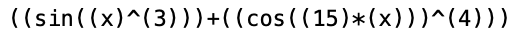
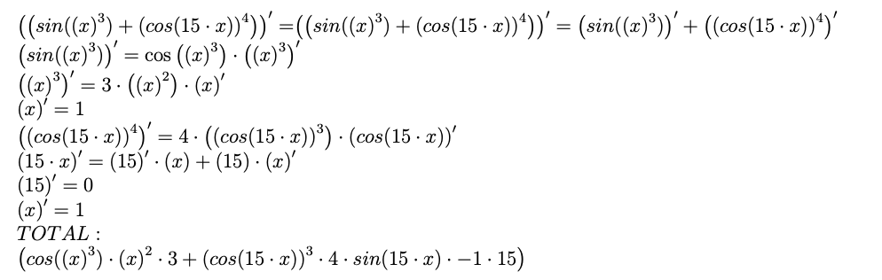

# differentiator 

My program, that can differentiate function, that will input from console. This is wolfram alpha brain !

### How do it work ?

1) You should to record your function in the a file that will be read into some buffer. 
If you will record function in file, you must follow the correct bracket sequence for each argument. It looks like this:

2) After sending into buffer, program decompose your function into the tree. 
In the lowest nodes that have right and left zero nodes, there will be variables and constants. 

3) It's time to move on to the rules of differentiation. Differentiation rules are described according to strict mathematical rules.
The differentiation rule will be applied to each node and called recursively for each node connected by a branch to the given.

4) Simplifying the new expression again using a sequential recursive call. 

As a result, you can get a graphic dump for the tree and TEX-file, where the final expression is written:

